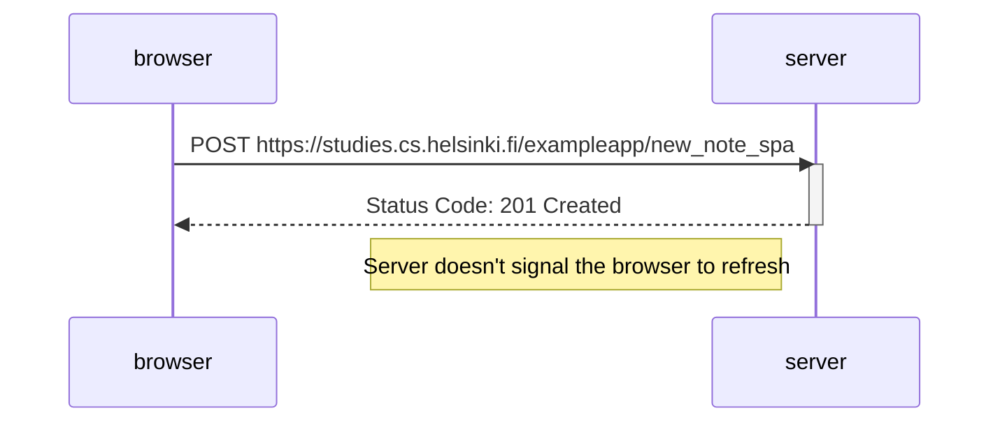

# New note in single page app sequence diagram

```mermaid
sequenceDiagram

participant browser
participant server

browser->>server: POST https://studies.cs.helsinki.fi/exampleapp/new_note_spa
activate server
server-->>browser: Status Code: 201 Created
deactivate server
Note left of server: Server doesn't signal the browser to refresh
```
