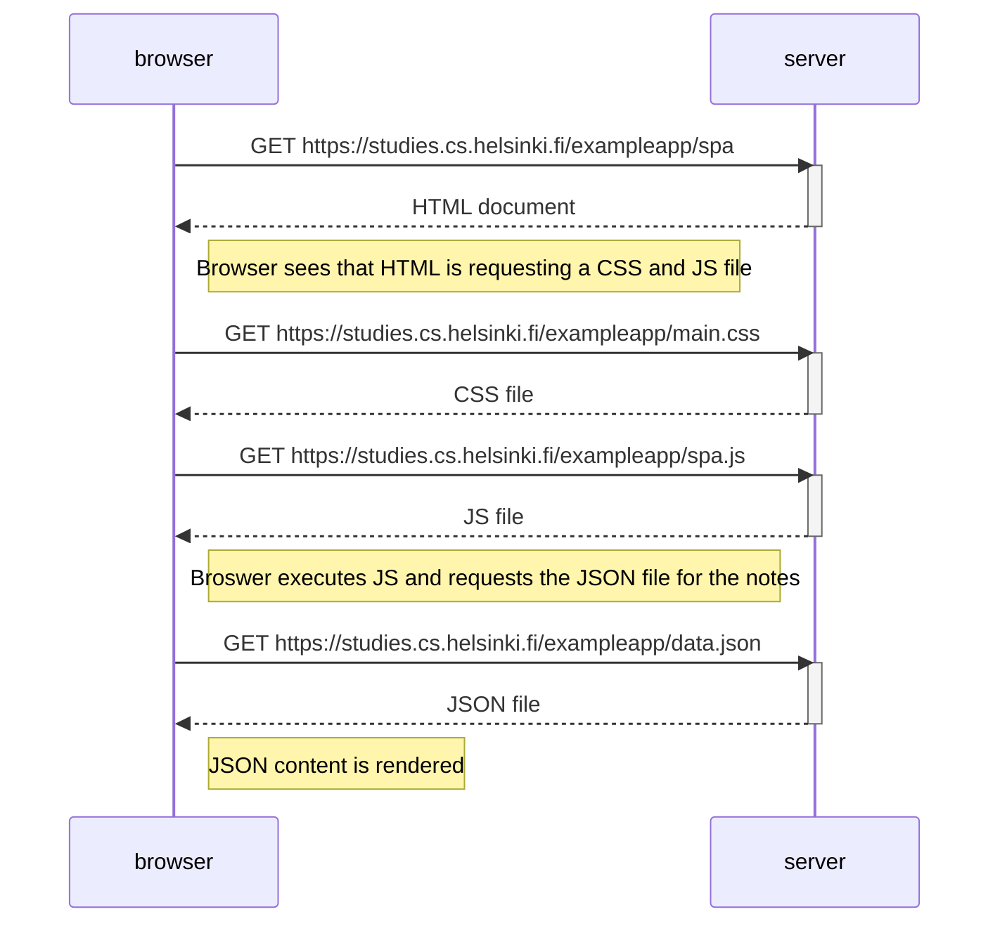

# Single page app diagram

```mermaid
sequenceDiagram

participant browser
participant server

browser->>server: GET https://studies.cs.helsinki.fi/exampleapp/spa
activate server
server-->>browser: HTML document
deactivate server
Note right of browser: Browser sees that HTML is requesting a CSS and JS file

browser->>server: GET https://studies.cs.helsinki.fi/exampleapp/main.css
activate server
server-->>browser: CSS file
deactivate server

browser->>server: GET https://studies.cs.helsinki.fi/exampleapp/spa.js
activate server
server-->>browser: JS file
deactivate server
Note right of browser: Broswer executes JS and requests the JSON file for the notes

browser->>server: GET https://studies.cs.helsinki.fi/exampleapp/data.json
activate server
server-->>browser: JSON file
deactivate server
Note right of browser: JSON content is rendered
```
